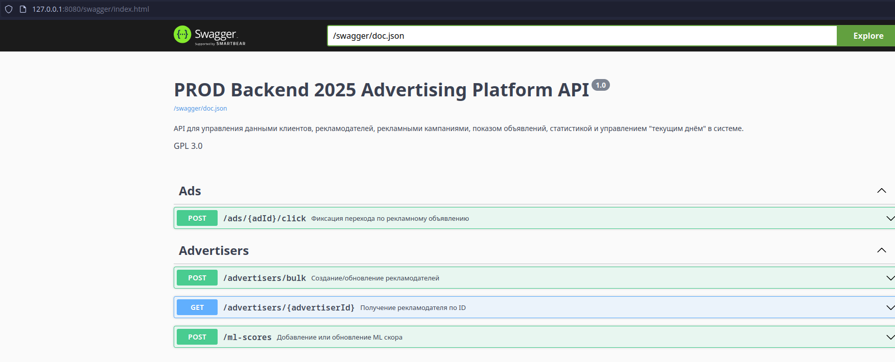
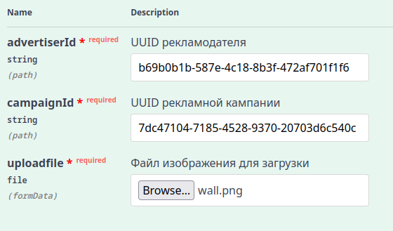
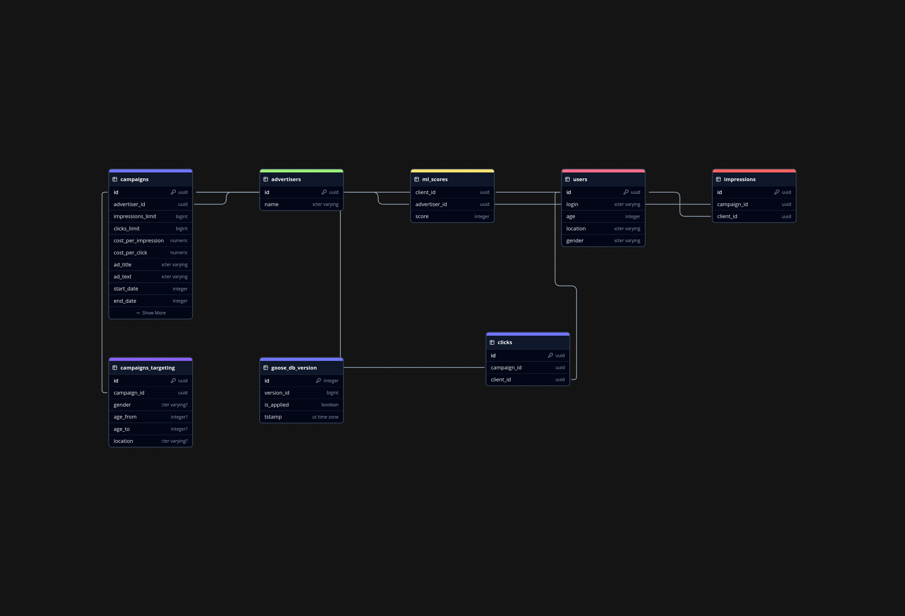

# Рекламная платформа

## Описание

Данный сервис написан на Go. Для удобной маршрутизации используется роутер [Chi](https://github.com/go-chi/chi). Миграции бд через [goose](https://github.com/pressly/goose)

| Технология | Обоснование                                                                         |
| ---------- | ----------------------------------------------------------------------------------- |
| PostgreSQL | Основная СУБД. Выбрана за надёжность, масштабируемость и поддержку сложных запросов |
| Redis      | Применяется для хранения сервисных данных (текущий день, статус модерации)          |
| MinIO      | S3-совместимое файловое хранилище. Применяется для хранения картинок кампаний       |
| pgAdmin    | Дебаг-администрирование базы данных                                                 |

## Запуск

Сервис можно легко развернуть с помощью Docker Compose.
База данных автоматически мигрирует при запуске контейнера решения с помощью уже упомянутой утилиты goose. В MinIO автоматически будет создан бакет, если он не существует.

```shell
docker-compose up -d
```

## Сам сервис

### Где описание всех эндпоинтов?

`/swagger/` - интерактивный swagger из коробки (swagger.yaml находится в директории docs/)



### Описание переменных окружения

```shell
SERVER_ADDRESS - Адрес сервера в формате host:port. Например, localhost:8080
DATABASE_URL - Строка подключения к базе данных (PostgreSQL). Например, postgresql://lotty:somepassword@db:5432/proood
REDIS_ADDRESS - Адрес Redis в формате host:port. Например, redis:6379
REDIS_PASSWORD - Пароль Redis (если нужен)
REDIS_DB - База данных Redis
OPENAI_BASE_URL - Адрес Ollama или другого OpenAI-совместимого API для модерации и генерации текста. Например, http://ollama-host:11434/v1/
OPENAI_API_KEY - API ключ для Ollama/OpenAI (по умолчанию для Ollama не нужен)
AI_MODERATION_MODEL - Модель для модерации. По умолчанию: qwen2.5:3b
AI_GENERATION_MODEL - Модель для генерации текстов кампаний. По умолчанию: qwen2.5:3b
MINIO_ENDPOINT - Адрес MinIO в формате host:port. Например, minio:9000
MINIO_ACCESS_KEY_ID - Юзер MinIO. Например, admin
MINIO_SECRET_ACCESS_KEY - Пароль юзера MinIO. Например, admin123
MINIO_BUCKET - Бакет MinIO. Если не задан, используется бакет по умолчанию: proood
MINIO_PUB_HOST - Публичный адрес MinIO. Используется для создания ссылки на картинку кампании. По умолчанию localhost:9000
```

### AI

В проекте реализована модерация и генерация текстов рекламных кампаний с помощью ИИ.
Используется OpenAI-совместимый API. Конкретно я использую Ollama и модель qwen2.5:3b для примера. Почему локальная нейросеть, а не общедоступная апишка? Во-первых, у нас нет лимитов. Во-вторых, данные никем не собираются, а я очень люблю конфиденциальность :). Также проводились тесты на более мощных моделях: qwen2.5:7b и qwen2.5:14b.

> Для всего этого вам нужно где-то развернуть Ollama и запуллить используемую модель.

Чтобы включить модерацию, необходимо один раз дёрнуть переключатель `PATCH /advertisers/campaigns/moderation`, который вернёт её новое состояние.

Генерация доступна по эндпоинту `POST /advertisers/campaigns/generate`. Тело запроса:

```
{
  "ad_title": "ПРОД",
  "advertiser_name": "Т-Банк"
}
```

### Работа с изображениями

К рекламной кампании можно добавить изображение:

`POST /advertisers/{advertiserId}/campaigns/{campaignId}/picture`

Изображение отправляется в параметре `formData` с названием `uploadfile`:



После этого при получении рекламной кампании в ответе будет общедоступная ссылка на это изображение по ключу `picture`.

### Схема базы данных



## Всё ли так хорошо?

К сожалению, я очень плохо реализовал самую главную фичу - показ объявлений пользователям, а также вообще не сделал статистику :(.
Будем считать, что это некий coming soon...
